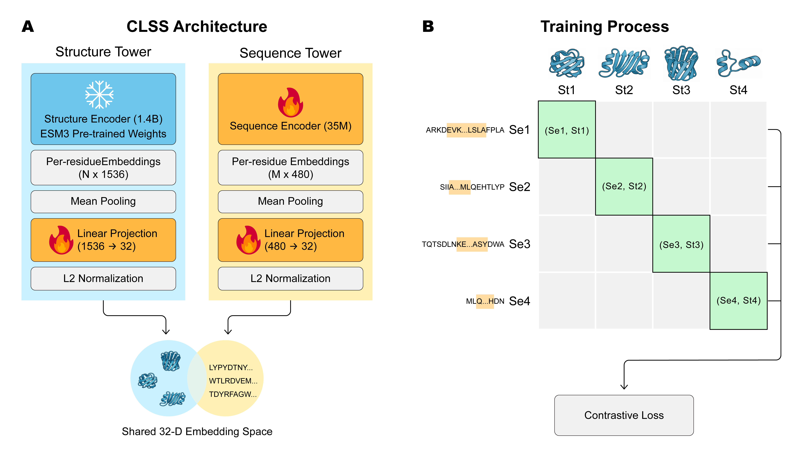
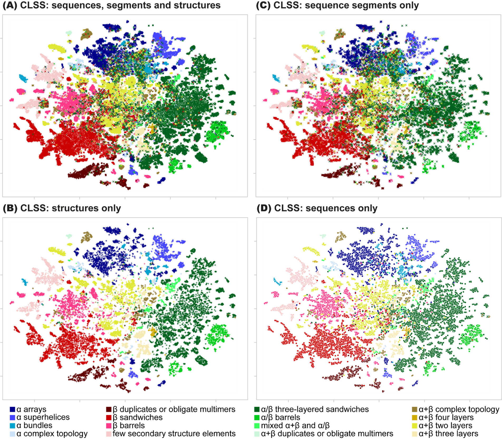

# CLSS: Contrastive learning unites sequence and structure in a global representation of protein space

**Paper (PNAS, 2026):** [https://www.pnas.org/doi/10.1073/pnas.2532702123](https://www.pnas.org/doi/10.1073/pnas.2532702123)

**DOI:** [https://doi.org/10.1073/pnas.2532702123](https://doi.org/10.1073/pnas.2532702123)

**SI Appendix:** [https://www.pnas.org/lookup/suppl/doi:10.1073/pnas.2532702123/-/DCSupplemental](https://www.pnas.org/lookup/suppl/doi:10.1073/pnas.2532702123/-/DCSupplemental)

**GitHub repository:** [https://github.com/guyyanai/CLSS](https://github.com/guyyanai/CLSS)

**Interactive viewer:** [https://gabiaxel.github.io/clss-viewer/](https://gabiaxel.github.io/clss-viewer/)

---

## Abstract

> Establishing a coherent mapping of the relationships among all known proteins is crucial for elucidating processes of protein emergence and evolution. Yet the capacity to fully capture relationships of protein similarity is complicated by the nonstraightforward interplay between sequence and structure; indeed, proteins with unrelated sequences can adopt similar structures, and, conversely, proteins with similar or identical sequences can manifest radically different structures. Here, we introduce Contrastive Learning Sequence–Structure (CLSS), a contrastive protein language model (PLM) trained to coembed sequence and structure information in a self-supervised manner, facilitating a holistic representation of protein relatedness. CLSS represents the structures and sequences of full domains and domain subsequences as vectors in the same high-dimensional latent space. We show that this approach yields meaningful shared representations, which recapitulate the extensive structure- and sequence-based knowledge encoded in human-curated hierarchical protein classification systems (ECOD and CATH). Moreover, the representations generated by CLSS outperform those generated by alternative state-of-the-art PLMs in downstream classification tasks. Notably, we show that even the far larger space of domain subsequences is successfully coembedded, establishing a PLM tailored to these evolutionarily meaningful objects. CLSS embeddings produce informative representations of the protein universe without further downstream processing, as we demonstrate by analyzing preferential associations between protein architectures and ligand types across protein space.

---

## TL;DR

**CLSS** is a self-supervised, two-tower contrastive model that co-embeds **protein sequences** and **structures** into a **shared 32‑D space**, enabling unified mapping of protein space across modalities.

---

## Key ideas

* **Two-tower architecture:** sequence tower (ESM2‑like, \~35M params) co-trained; structure tower (ESM3) kept frozen; both feed **32‑D L2‑normalized adapters**.
* **Subsequence-aware training (CLSS-sub):** contrastive pairs match **full-domain structures** with **random domain subsequences (min length 10 aa)** to encode contextual compatibility; **CLSS-full** instead pairs full-length sequences with structures.
* **Unified embeddings:** sequences, structures, and subsequences align in a **single space**; distances track the ECOD and CATH hierarchies and outperform other PLMs on downstream classification.
* **Scale & efficiency:** \~36M trainable params, compact embeddings (32‑D) supporting efficient inference and training.
* **Resources:** code + weights, and a public **CLSS viewer** for exploration.

> See paper for full details, datasets, ablations, and comparisons.

### Architecture

<p align="center">
  
</p>

**Figure 1 (paper Fig. 1):** The CLSS architecture and training process. (A) CLSS has two towers: the sequence tower (ESM2-like architecture and initial weights) and its adapter network, and the structure tower (frozen ESM3 architecture and weights) and its adapter network. (B) During training, we calculated the embeddings using both towers. For CLSS-sub, a sampled subsequence (marked by boxes) was paired with the full domain structure. We then optimized the contrastive loss, which aims to maximize the dot-product similarities between embeddings corresponding to the same domain (marked in green), while minimizing other dot-product similarities (gray), using cross-entropy.

---

## Visualization

CLSS embeddings capture the global organization of protein space, revealing evolutionary relationships and structural similarities across diverse protein domains.

<p align="center">
  
</p>

**Figure 2 (enlarged CLSS-sub row of paper Fig. 2; see also SI Appendix):** CLSS-sub embedding maps of ECOD domains (Dataset S1). For each domain, we calculate the embeddings by three modalities – structure, sequence, and a random subsequence – and then compute a t-SNE projection of the dataset of all embeddings. Each point represents one of the modalities of a domain colored according to the label of its ECOD architecture. (A) Map of all three modalities. Sequences are marked by circles, structures by ‘+’, and random subsequences by ‘x’. For clarity we show only (B) structure embeddings, (C) subsequence embeddings, (D) sequence embeddings. We find that the maps of all three modalities are very similar to each other, with the sequence (D) and structure (B) embeddings being the closest. The global organization of the CLSS-sub embedding space positions domains with the same ECOD architecture, and even the same structure class, near each other.

---

## Quick Start

### Installation

```bash
pip install clss-model
```

### Loading the Model

Load the pretrained CLSS model from the Hugging Face Hub:

```python
from clss import CLSSModel

# Load CLSS-sub from Hugging Face (downloads automatically)
model = CLSSModel.from_pretrained(
    repo_id="guyyanai/CLSS",       # default
    model_name="CLSS-sub.lckpt",   # default, could also use CLSS-full.lckpt
    device="cuda",                 # or "cpu"
)

# For CLSS-full
model = CLSSModel.from_pretrained(
    repo_id="guyyanai/CLSS",
    model_name="CLSS-full.lckpt",
    device="cuda",
)
```

To load from a local checkpoint instead:

```python
model = CLSSModel.from_checkpoint("path/to/checkpoint.lckpt", device="cuda")
```

By default, only the sequence tower (ESM2-based) is loaded. To also load the structure tower (ESM3) for structure embeddings, call:

```python
model.load_esm3()
```

### Examples

Complete examples are available in the [`examples/`](examples/) directory:

- **[`examples/training/`](examples/training/)** - Full training pipeline
  - `train.py` - Main training script with PyTorch Lightning
  - `dataset.py` - ECOD dataset loading and preprocessing  
  - `args.py` - Command-line argument parsing
  - `infra.py` - Infrastructure setup (distributed training, logging)

- **[`examples/inference/`](examples/inference/)** - Inference and embedding
  - `infer.py` - Protein sequence and structure embedding
  - `sample-pdbs/` - Example PDB files for testing

- **[`examples/interactive-map/`](examples/interactive-map/)** - Interactive visualization
  - `app.py` - Complete pipeline from data to interactive HTML visualization
  - `mapper.py` - Plotly-based interactive scatter plot creation
  - `dataset.py` - Multi-modal data loading (FASTA/PDB)
  - `embeddings.py` - CLSS model inference and embedding generation
  - `dim_reducer.py` - t-SNE dimensionality reduction

---

## Data

* **ECOD‑AF2 domains** (training/validation set) - Available in `datasets/training/`
* **DEV292-F40-large-folds** (Dataset S1 from paper) - Available in `datasets/DEV292-F40-large-folds/`
  - Contains all ECOD-DEVELOP292 F40 domains in folds with more than 50 domains
* **CATHS40-large-folds** (Dataset S2 from paper) - Available in `datasets/CATHS40-large-folds/`
  - Contains all CATHS40 domains in folds with more than 50 domains
* **rogen-metamorphic** (Dataset S3 from paper) - Available in `datasets/rogen-metamorphic/`
  - Contains metamorphic CATH domains from Peter Røgen's dataset of sequence-similar but topologically distinct domain pairs [Rogen et al. 2025]
* **DEV291-F40-large-folds** - Available in `datasets/DEV291-F40-large-folds/`
  - Contains all ECOD-DEVELOP291 F40 domains in folds with more than 50 domains (used in the paper for binding exploration)


---

## Citation

If you use this repository, please cite:

```bibtex
@article{Yanai2026CLSS,
  title={Contrastive learning unites sequence and structure in a global representation of protein space},
  author={Yanai, Guy and Axel, Gabriel and Longo, Liam M. and Ben-Tal, Nir and Kolodny, Rachel},
  journal={Proceedings of the National Academy of Sciences},
  volume={123},
  number={32},
  pages={e2532702123},
  year={2026},
  doi={10.1073/pnas.2532702123},
  url={https://www.pnas.org/doi/10.1073/pnas.2532702123}
}
```

---

## Acknowledgments & Contact

* See the paper for funding and acknowledgments.
* Correspondence: [llongo@elsi.jp](mailto:llongo@elsi.jp), [bental@tauex.tau.ac.il](mailto:bental@tauex.tau.ac.il), [trachel@cs.haifa.ac.il](mailto:trachel@cs.haifa.ac.il).
