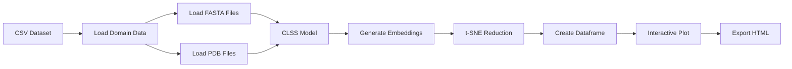

# CLSS Interactive Protein Domain Map (WIP)

An interactive visualization tool for exploring protein domains through multi-modal embeddings using the CLSS (Contrastive Learning of Sequence and Structure) model.

**WARNING** This is a Work In Progress!

## Overview

This application creates an interactive 2D visualization of protein domains by:

1. **Processing Multi-Modal Data**: Reading protein sequences (FASTA) and structures (PDB) 
2. **AI-Powered Embeddings**: Using the CLSS model to generate unified embeddings for both sequences and structures
3. **Dimensionality Reduction**: Applying t-SNE to project high-dimensional embeddings to 2D space
4. **Interactive Visualization**: Creating a Plotly/Dash scatter plot where users can explore domain relationships

## Features

- 📊 **Multi-modal visualization** - sequences and structures in the same embedding space
- 🎨 **Color-coded labels** - protein domains colored by functional/structural categories
- 🔍 **Shape-coded modalities** - different markers for sequence vs structure data
- 💾 **Smart caching** - avoids recomputing expensive operations
- 📱 **Interactive exploration** - zoom, pan, hover for detailed information
- 📄 **Export capability** - save visualizations as standalone HTML files

## Pipeline Overview



## Installation

### Prerequisites

- Python 3.8+
- PyTorch
- Required Python packages (see `requirements.txt`)

### Setup

```bash
# Clone the repository
git clone https://github.com/guyyanai/CLSS.git
cd CLSS/examples/interactive-map

# Install dependencies
pip install -r requirements.txt

# Download CLSS model (if not using default HuggingFace repo)
# The tool will automatically download from HuggingFace Hub
```

## Usage

### Basic Command

```bash
python app.py --dataset-path domains.csv --id-column domain_id --label-column fold_class --fasta-path-column fasta_file --pdb-path-column pdb_file
```

### Full Example

```bash
python app.py \
    --dataset-path datasets/ecod_domains.csv \
    --id-column domain_id \
    --label-column architecture \
    --fasta-path-column sequence_path \
    --pdb-path-column structure_path \
    --model-repo guyyanai/CLSS \
    --model-filename h32_r10.lckpt \
    --tsne-perplexity 50 \
    --tsne-max-iterations 1000 \
    --cache-path ./cache
```

### CLI Arguments

| Argument | Required | Default | Description |
|----------|----------|---------|-------------|
| `--dataset-path` | ✅ | - | Path to CSV file with domain data |
| `--id-column` | ✅ | - | Column name for domain IDs |
| `--label-column` | ✅ | - | Column name for labels (determines colors) |
| `--fasta-path-column` | * | - | Column name for FASTA file paths |
| `--pdb-path-column` | * | - | Column name for PDB file paths |
| `--model-repo` | ❌ | `guyyanai/CLSS` | HuggingFace model repository |
| `--model-filename` | ❌ | `h32_r10.lckpt` | Model checkpoint filename |
| `--tsne-perplexity` | ❌ | 30 | t-SNE perplexity parameter |
| `--tsne-max-iterations` | ❌ | 1000 | Maximum t-SNE iterations |
| `--tsne-random-state` | ❌ | 0 | Random state for reproducibility |
| `--cache-path` | ❌ | - | Directory for caching intermediate results |

*At least one of `--fasta-path-column` or `--pdb-path-column` must be provided.

## Input Data Format

### CSV Dataset Structure

Your input CSV should contain the following columns:

```csv
domain_id,architecture,sequence_path,structure_path
d1a00a_,alpha/beta,/path/to/d1a00a_.fasta,/path/to/d1a00a_.pdb
d1a01a_,alpha,/path/to/d1a01a_.fasta,/path/to/d1a01a_.pdb
d1a02a_,beta,/path/to/d1a02a_.fasta,/path/to/d1a02a_.pdb
```

### File Requirements

- **FASTA files**: Standard protein sequence format
- **PDB files**: Standard Protein Data Bank format
- **Paths**: Can be relative or absolute paths to the files

## Output

The application generates:

1. **Console Output**: Progress information and statistics
2. **Interactive HTML**: Standalone HTML file with the interactive visualization
3. **Cached Data**: Intermediate results stored for faster re-runs (if `--cache-path` specified)

### Visualization Features

- **Scatter Plot**: Each point represents a domain-modality pair
- **Color Coding**: Points colored by the label column (e.g., protein fold, function)
- **Shape Coding**: Different markers for sequences (circles) vs structures (squares)
- **Hover Information**: Detailed domain information on mouse hover
- **Zoom & Pan**: Interactive exploration of the embedding space
- **Export Options**: Save plots as PNG, SVG, or HTML

## Performance & Caching

### Caching Strategy

The tool implements multi-level caching to avoid expensive recomputation:

1. **Sequence Loading**: Cached parsed FASTA sequences
2. **Structure Loading**: Cached parsed PDB structures  
3. **Embeddings**: Cached CLSS model outputs
4. **Dimensionality Reduction**: Cached t-SNE results

### Performance Tips

- Use `--cache-path` for large datasets
- Adjust `--tsne-perplexity` based on dataset size

## Architecture

### Component Overview

- **`args.py`**: CLI argument parsing with type safety
- **`dataset.py`**: Data loading and preprocessing functions
- **`embeddings.py`**: CLSS model loading and embedding generation
- **`dim_reducer.py`**: t-SNE dimensionality reduction
- **`mapper.py`**: Interactive visualization creation
- **`utils.py`**: Utility functions and caching helpers
- **`app.py`**: Main application orchestrator

### Data Flow

1. **Dataset Loading**: Parse CSV and validate columns
2. **File Reading**: Load sequences from FASTA and structures from PDB
3. **Model Loading**: Initialize CLSS model from HuggingFace Hub
4. **Embedding Generation**: Process sequences and structures through CLSS
5. **Data Structuring**: Create unified dataframe with embeddings
6. **Dimensionality Reduction**: Apply t-SNE to reduce to 2D
7. **Visualization**: Generate interactive Plotly scatter plot
8. **Export**: Save as standalone HTML file

## Troubleshooting

### Common Issues

**Model Loading Errors**
```bash
# Ensure you have internet connection for HuggingFace download
# Or specify a local model path
--model-repo /path/to/local/model
```

**Memory Issues with Large Datasets**
```bash
# Use smaller batch sizes or enable caching
--cache-path ./cache
# Reduce t-SNE iterations for faster processing
--tsne-max-iterations 500
```

**File Path Errors**
```bash
# Ensure all file paths in CSV are accessible
# Use absolute paths if having issues with relative paths
```

### Performance Optimization

- **GPU Acceleration**: The CLSS model will automatically use GPU if available
- **Parallel Processing**: Multiple CPU cores used for file I/O operations
- **Memory Management**: Large datasets processed in batches to avoid memory overflow

## Citation

If you use this tool in your research, please cite:

```bibtex
@software{clss_interactive_map,
  title={CLSS Interactive Protein Domain Map},
  author={[Your Name]},
  year={2025},
  url={https://github.com/guyyanai/CLSS}
}
```

## License

This project is licensed under the same terms as the CLSS model. See the LICENSE file for details.

## Support

For issues and questions:
- 🐛 **Bug Reports**: Create an issue on GitHub
- 💡 **Feature Requests**: Discuss in GitHub Discussions
- 📖 **Documentation**: Check the examples and code comments